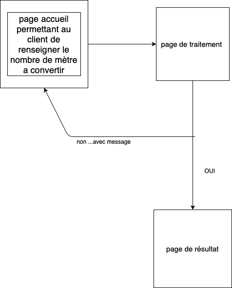
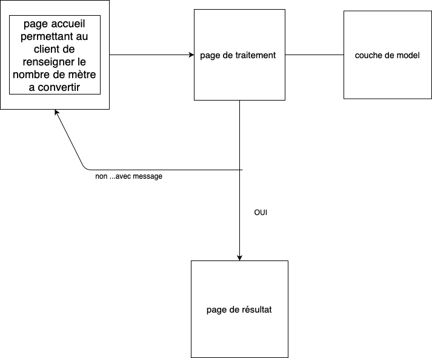

# exo annexe2 #

****
en tant qu'utilisateur j'aimerais pouvoir renseigner des metres (mesure) et avoir sa convertion en CM
****

****
en tant qu'utilisateur j'aimerais pouvoir convertir les metres en differentes mesure plus petite CM, DM, MM et égalemnt en mesure plus grande (de metre en kilometres)
****
refactorisation du code en implementer un couche suplementaire (model) et refactorisant les fonction logique en class (si ce n'est pas deja fait)

****
en tant qu'utilisateur je voudrais avoir une solution complète pour convertir tout type de mesure du kilometres au millimetres ()
****

## LOOKING ##

POO-- avec une couche abstraction supllementaire (modele). 

